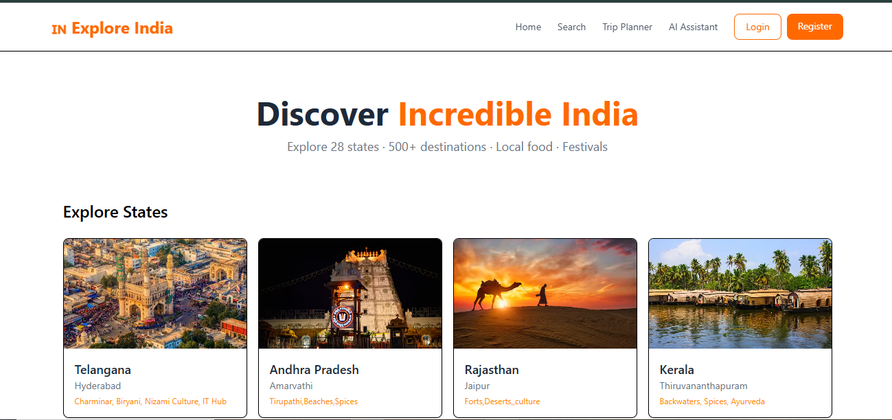
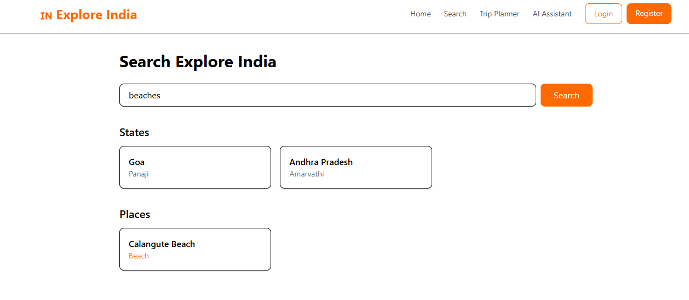
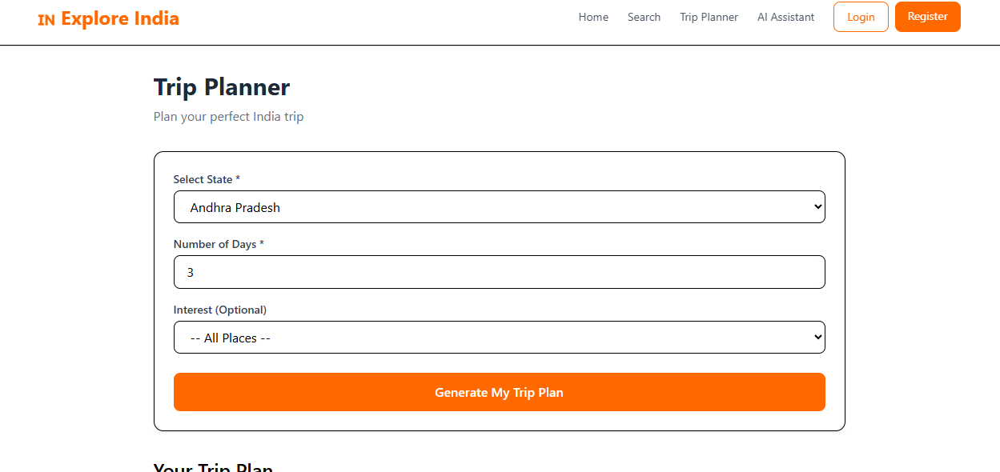
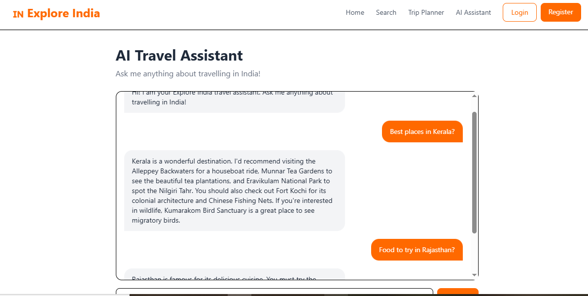
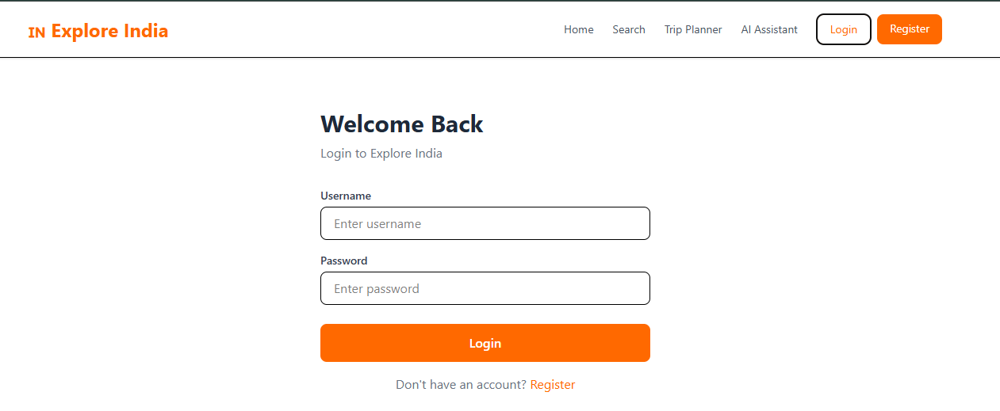
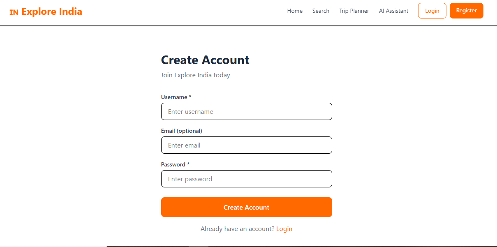

# 🇮🇳 Explore India

Explore India is a full-stack travel web application that helps users discover famous destinations, local cuisines, festivals, and plan trips across all 28 Indian states. The application also includes an AI-powered travel assistant to answer travel-related questions.

## 🌐 Live Demo

Frontend: https://explore-india-yqpx-io1j8b9p5-umakambampatis-projects.vercel.app/

Backend API: https://explore-india-qpba.onrender.com/

---

# ✨ Features

- 🗺️ Explore all 28 Indian states
- 📍 View famous tourist places
- 🍛 Discover state-wise famous foods
- 🎉 Learn about cultural festivals and events
- 🔍 Search destinations easily
- 🧳 Smart Trip Planner
- 🤖 AI Travel Assistant
- 🔐 User Registration & Login
- 📱 Responsive UI

---

# 🛠 Tech Stack

### Frontend

- React.js
- Vite
- JavaScript
- CSS
- Axios

### Backend

- Django
- Django REST Framework
- Python

### Database

- MySQL

### Deployment

- Vercel (Frontend)
- Render (Backend)

---

# 📸 Screenshots

## Home Page



---

## State Page


---

## Place Page


---

## Search Page



---

## Trip Planner



---

## AI Travel Assistant



---

## Login



---

## Register



---

# 🚀 Installation

Clone the repository

```bash
git clone https://github.com/Umakambampati/Explore_india.git
```

Frontend

```bash
cd frontend/react
npm install
npm run dev
```

Backend

```bash
cd backend
pip install -r requirements.txt
python manage.py migrate
python manage.py runserver
```

---

# 📂 Project Structure

```
Explore_India/
│
├── backend/
├── frontend/
│   └── react/
├── screenshots/
└── README.md
```

---

# 👩‍💻 Author

**Uma Maheshwari Kambampati**

GitHub: https://github.com/Umakambampati